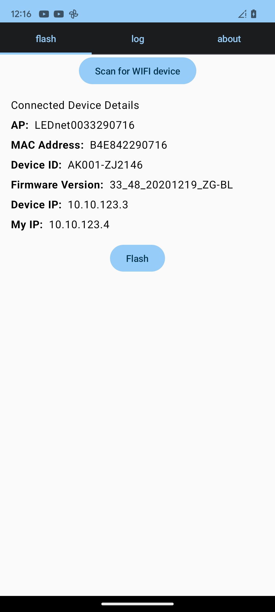

# Magic Home Flasher (BL602)

## Introduction
Magic Home Flasher is an Android application designed to flash Magic Home devices equipped with a RISC-V BL602 chip using the OpenBeken firmware available from the OpenBeken_App project on GitHub. This tool simplifies the process of updating devices to use open-source firmware, enhancing their functionality and customizability.

## Features
- **Simple Device Updating**: Select and flash devices with new firmware directly over the air. No soldering required
- **Open Source**: Leverage and contribute to the open-source community.

## Getting Started
These instructions will guide you through the setup and operation of Magic Home Flasher.

### Prerequisites
- An Android device running Android 29 or higher.
- A Magic Home device with a BL602 chip within range.

### Installation
1. Download the latest release of Magic Home Flasher from the [Releases](https://github.com/kruzer/mhflasher/releases) section on GitHub.
2. Install the APK on your Android device. You may need to enable installation from unknown sources in your device settings.

### Usage
1. Open the Magic Home Flasher app.
2. Tap on the **Scan Wifi Devices** button to discover available Wi-Fi networks.
3. Look for networks named like `LEDnetXXXXXX`. These are typically broadcast by Magic Home devices.
4. Select the network corresponding to the device you wish to flash.
5. The app will automatically handle the OTA update process by serving the firmware over an internal HTTP server.
6. Once the device downloads and applies the firmware, it will reboot automatically, running the new OpenBeken system.



## Firmware
The firmware used by Magic Home Flasher is provided by the OpenBK7231T_App project. You can find more information and contribute to the firmware development at [OpenBeken_App GitHub Repository](https://github.com/openshwprojects/OpenBK7231T_App).

## Reverse engineer risc-v chip
All info is based on the process of a reverse engineering the risc-v Boufalo Laabs chip bl602 diescribed [here](/reverse_engineeer)
You can use a shell commands to achieve similar result:
serve http file on port 1111:
```shell
{
    echo -ne "HTTP/1.0 200 OK\r\nContent-Length: "$(wc -c < OpenBL602_1.17.551_OTA.bin.xz.ota)"\r\n\r\n"
    cat  OpenBL602_1.17.551_OTA.bin.xz.ota 
} | nc -l 1111
```
invoke flashing process (from another terminal):
```shell
echo -e "AT+UPURL=http://10.10.123.4:1111/update?version=33_00_20240418_OpenBeken&beta,pierogi" | nc -u 10.10.123.3 48899
```
List of all AT commands recognized by firmware is available [here](reverse_engineer/at_commands.txt) 
For example to check version before flashing use:
```shell
echo -e "AT+LVER\r" | nc -u 10.10.123.3 48899
```
## TODO

The following features are planned for future releases of Magic Home Flasher to enhance its functionality and user experience:

- **Wi-Fi Settings Configuration**: Add the capability to change the SSID and password of the Magic Home device directly from the app. This feature will allow users to manage their device's network settings easily without needing additional tools.

- **Automatic Firmware Updates**: Integrate functionality to automatically fetch the latest version of OpenBeken firmware from the GitHub repository. This will ensure that users always have access to the latest features and security updates without manually checking for new releases.

These enhancements aim to streamline the user experience and expand the functionality of Magic Home Flasher, making it a more robust and convenient tool for updating Magic Home devices.

## Contributing
Contributions to Magic Home Flasher are welcome! Whether it's reporting issues, submitting fixes, or proposing new features, your help is appreciated.

### How to Contribute
1. Fork the repository.
2. Create your feature branch (`git checkout -b feature/AmazingFeature`).
3. Commit your changes (`git commit -m 'Add some AmazingFeature'`).
4. Push to the branch (`git push origin feature/AmazingFeature`).
5. Open a new Pull Request.

## License
This project is licensed under the MIT License - see the [LICENSE.md](LICENSE.md) file for details.

## Acknowledgments
- Thanks to the OpenBK7231T_App project for providing the firmware.
- Community contributions that help improve this tool.

## Support
For support, open an issue in the GitHub repository.

>[!Warning]
>Flashing non-original firmware on your device carries inherent risks. By proceeding with the installation of any non-original firmware, you acknowledge and accept that such actions may potentially brick or permanently damage your device. Please be aware that installing firmware that has not been officially released or endorsed by the manufacturer voids any warranties and releases the manufacturer from any liabilities related to device performance or failure.
>
>**Proceed at your own risk**. It is highly recommended that you thoroughly review the firmware documentation and understand the flashing process before attempting any modifications. The authors of this tool or firmware are not responsible for any damages or losses that may occur from the use of this software.
---
For more information on how to use Magic Home Flasher, please refer to the wiki or contact support.
