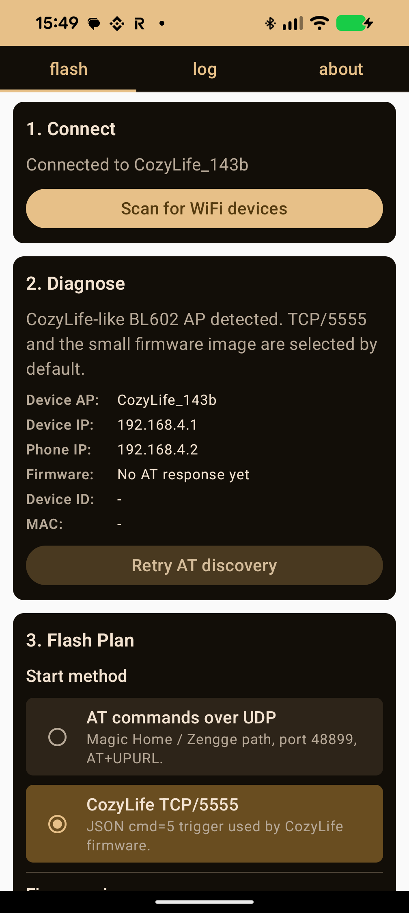
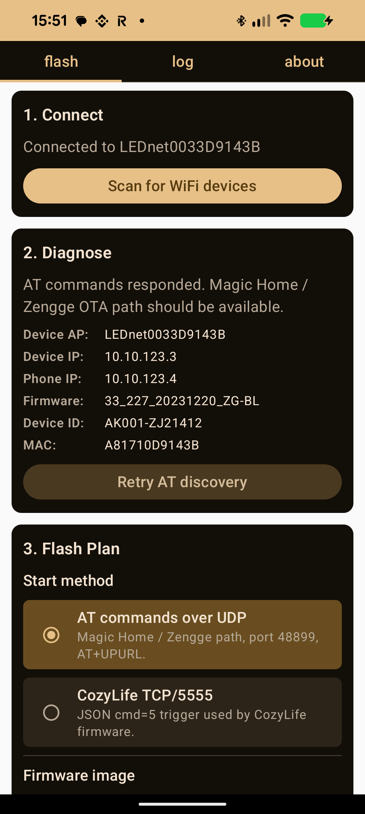

# Magic Home Flasher

## Introduction
Magic Home Flasher is an Android application designed to flash LED controllers over Wi-Fi OTA. It started as a BL602 Magic Home flasher for installing [OpenBeken](https://github.com/openshwprojects/OpenBK7231T_App), and now also covers more vendor firmware variants, including Zengge/ZJ and CozyLife devices, by supporting multiple OTA trigger methods.

Recent versions also include experimental restore flows: upgrading an existing OpenBeken installation, replacing OpenBeken with selected vendor firmware images, and initial OTA support for CozyLife devices based on LN882H.

## Features
- **Simple Device Updating**: Select and flash devices with new firmware directly over the air. No soldering required.
- **Broader Device Support**: Supports the classic Magic Home/Zengge UDP AT command OTA path and an additional CozyLife TCP/5555 OTA trigger.
- **Zengge OTA Header Patching**: Builds OTA files with the vendor header fields required by newer Zengge/ZJ firmware.
- **Standard and Small Firmware Images**: Includes a full OpenBeken image and a smaller minimal image for devices that report only 1MB flash.
- **OpenBeken OTA Upgrade and Restore**: Can trigger OTA from devices already running OpenBeken, either to upgrade OpenBeken or to restore selected vendor firmware images.
- **Experimental Vendor OTA Catalog**: Can download selected BL602 vendor OTA files generated from public flash dumps, including images based on the [FlashDumps IoT/BL602 collection](https://github.com/divadiow/FlashDumps/tree/main/IoT/BL602).
- **Experimental LN882H Support**: Includes an early OTA path for CozyLife/LN882H devices.
- **Open Source**: Leverage and contribute to the open-source community.

## Getting Started
These instructions will guide you through the setup and operation of Magic Home Flasher.

### Prerequisites
- An Android device running Android 29 or higher.
- A BL602-based device in pairing/AP mode, for example Magic Home, Zengge/ZJ, or CozyLife.

### Installation
1. Download the latest release of Magic Home Flasher from the [Releases](https://github.com/kruzer/mhflasher/releases) section on GitHub.
2. Install the APK on your Android device. You may need to enable installation from unknown sources in your device settings.

### Usage
1. Open the Magic Home Flasher app.
2. Tap **Scan for WiFi devices** to discover nearby device access points.
3. Select the network corresponding to the device you want to flash. Magic Home/Zengge devices commonly use names like `LEDnetXXXXXX`; CozyLife devices commonly use names like `CozyLife_XXXX`; OpenBeken access points commonly use names like `OpenBLXXXXXX`.
4. After connection, review the detected device details and the suggested flash plan.
5. Choose the OTA trigger method if the default is not correct:
   - **AT commands over UDP** for Magic Home and Zengge/ZJ firmware.
   - **CozyLife TCP/5555** for CozyLife firmware.
   - **OpenBeken REST upload** for devices already running OpenBeken.
6. Choose the firmware image:
   - **Standard OpenBeken** for normal flash sizes.
   - **Small OpenBeken (1MB-safe)** for devices that report a 1MB flash. CozyLife devices often fall into this category, and the full OpenBeken image may not fit.
   - **Vendor restore** for experimental flashing of selected vendor OTA images onto devices currently running OpenBeken.
7. Optionally preconfigure the target Wi-Fi SSID, password, and OpenBeken hostname before flashing.
8. Start flashing. The app patches the firmware, builds an OTA image, serves it from the phone, and triggers the device to download it.
9. After the upload finishes, wait 15-30 seconds for the device to reboot and join the configured network. If it does not appear, power-cycle it manually.

<p>
  
  
</p>

## Firmware
The firmware used by Magic Home Flasher is provided by the OpenBK7231T_App project. You can find more information and contribute to the firmware development at [OpenBeken_App GitHub Repository](https://github.com/openshwprojects/OpenBK7231T_App).

The app currently bundles two BL602 OTA payload variants:
- **Standard OpenBeken**: the normal full-featured build.
- **Small OpenBeken**: a minimal build intended for devices with only 1MB flash, especially CozyLife devices where the standard image may be too large.

Both variants are patched before flashing so Wi-Fi configuration can be injected and the BL602 OTA header contains the fields required by newer Zengge/ZJ firmware.

## Experimental Vendor Restore
Magic Home Flasher can also flash selected vendor OTA images onto devices that are already running OpenBeken. This is useful when testing recovery paths or returning a device to a vendor firmware family without opening the device.

The app can use:
- OTA files downloaded from the experimental vendor catalog.
- Local OTA files selected from Android storage.
- BL602 OTA files generated from public flash dumps, for example dumps from the [FlashDumps IoT/BL602 collection](https://github.com/divadiow/FlashDumps/tree/main/IoT/BL602).

This flow is experimental. Vendor images are device-specific, so choose a matching image for the original hardware, flash size, and firmware family. A successful upload does not guarantee that a mismatched vendor image will boot correctly.

## Experimental LN882H Support
Some CozyLife devices use LN882H instead of BL602. The app includes an early TCP/5555 OTA path for this family and can flash an LN882H OpenBeken OTA image. This support is still experimental and depends on the exact vendor firmware behavior.

## Reverse engineer risc-v chip
All info is based on the process of a reverse engineering the risc-v Bouffalo Labs chip bl602 described [here](reverse_engineer/README.md)
You can use a shell commands to achieve similar result:
serve http file on port 1111:
```shell
OTA_FILE=OpenBL602_<version>_OTA.bin.xz.ota
{
    echo -ne "HTTP/1.0 200 OK\r\nContent-Length: "$(wc -c < "$OTA_FILE")"\r\n\r\n"
    cat "$OTA_FILE"
} | nc -l 1111
```
invoke flashing process (from another terminal):
```shell
echo -e "AT+UPURL=http://10.10.123.4:1111/update?version=33_00_20240418_OpenBeken&beta,pierogi" | nc -u 10.10.123.3 48899
```
List of all AT commands recognized by firmware is available [here](reverse_engineer/at_commands.txt) 
For example to check version before flashing use:
```shell
echo -e "AT+LVER\r" | nc -u 10.10.123.3 48899
```
## TODO

The following features are planned for future releases of Magic Home Flasher to enhance its functionality and user experience:

- **Wi-Fi Settings Configuration**: Add the capability to change the SSID and password of the Magic Home device directly from the app. This feature will allow users to manage their device's network settings easily without needing additional tools.

- **Automatic Firmware Updates**: Integrate functionality to automatically fetch the latest version of OpenBeken firmware from the GitHub repository. This will ensure that users always have access to the latest features and security updates without manually checking for new releases.

These enhancements aim to streamline the user experience and expand the functionality of Magic Home Flasher, making it a more robust and convenient tool for updating Magic Home devices.

## Contributing
Contributions to Magic Home Flasher are welcome! Whether it's reporting issues, submitting fixes, or proposing new features, your help is appreciated.

### How to Contribute
1. Fork the repository.
2. Create your feature branch (`git checkout -b feature/AmazingFeature`).
3. Commit your changes (`git commit -m 'Add some AmazingFeature'`).
4. Push to the branch (`git push origin feature/AmazingFeature`).
5. Open a new Pull Request.

## License
This project is licensed under the MIT License - see the [LICENSE.md](LICENSE.md) file for details.

## Acknowledgments
- Thanks to the OpenBK7231T_App project for providing the firmware.
- Community contributions that help improve this tool.

## Support
For support, open an issue in the GitHub repository.

>[!Warning]
>Flashing non-original firmware on your device carries inherent risks. By proceeding with the installation of any non-original firmware, you acknowledge and accept that such actions may potentially brick or permanently damage your device. Please be aware that installing firmware that has not been officially released or endorsed by the manufacturer voids any warranties and releases the manufacturer from any liabilities related to device performance or failure.
>
>**Proceed at your own risk**. It is highly recommended that you thoroughly review the firmware documentation and understand the flashing process before attempting any modifications. The authors of this tool or firmware are not responsible for any damages or losses that may occur from the use of this software.
---
For more information on how to use Magic Home Flasher, please refer to the wiki or contact support.
